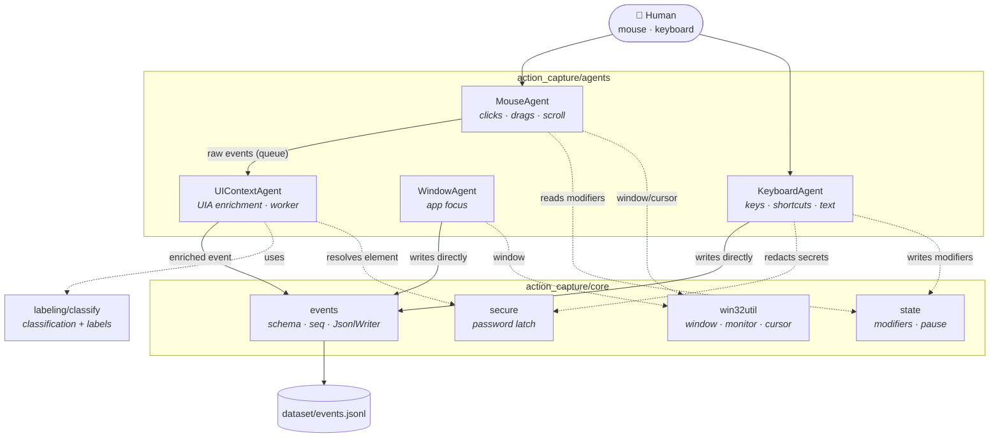

# mark43 — computer-use dataset recorder

Captures a timeline of a human's actions on Windows (mouse, keyboard and UI
context) as **JSONL**, to train a model that infers **what** the user did and
**how** they did it.

## Installation

```bash
pip install -r requirements.txt
```

Dependencies: `pynput`, `pywin32`, `uiautomation`, `psutil` (Windows).

### Use it as an AI assistant (Claude Code / Codex)

To wire the capture into Claude Code and Codex so they get context on what you
did between turns, run the installer once:

```bash
python install.py        # or double-click install.bat on Windows
```

It installs the package and registers the MCP server + activity hooks globally.
See [`docs/INTEGRATION.md`](docs/INTEGRATION.md) for details, flags, and the
project-scoped alternative.

## Usage

Everything runs from `capture.py`:

```bash
python capture.py                    # full capture (aggregated text)
python capture.py --capture-text     # + selected text (never in password fields)
python capture.py --a11y-snapshot    # + accessibility tree per click
python capture.py --mask-keys        # no key content (categories only)
python capture.py --no-aggregate     # one row per keystroke (no text grouping)
python capture.py --out session1     # output folder per session
python capture.py --help
```

Controls while recording:

| Key | Action |
|-----|--------|
| `Esc` | stop and save |
| `Ctrl+Alt+P` | pause / resume (nothing is recorded while paused) |

Output is written to `dataset/events.jsonl` (one action per line).

## Architecture

Each concern is a standalone **agent** that emits enriched events into a single
timeline. Mouse events go through an enrichment stage (UI Automation) on a
separate worker, so the listeners never block and no events are dropped.



### Modules

| Module | Responsibility |
|--------|----------------|
| `capture.py` | Entry point; launches the package. |
| `agents/mouse.py` | Clicks (single/double/triple), scroll, and drags with a sampled path. |
| `agents/keyboard.py` | Keys, shortcuts, typed-text aggregation, and password redaction. |
| `agents/ui_context.py` | Resolves the UIA element (type, name, state, ancestry), drop target, selected text, and a11y snapshot. Enrichment stage. |
| `agents/window.py` | Detects application focus changes. |
| `agents/snapshot.py` | Bounded accessibility tree (the "structured screenshot"). |
| `labeling/classify.py` | Pure functions: gesture classification and readable labels. |
| `core/events.py` | Event schema (`schema_version`, `seq`, `timestamp`) and the JSONL sink. |
| `core/secure.py` | Password-field detection (UIA `IsPassword` + Win32 `ES_PASSWORD`). |
| `core/win32util.py` | Active window, monitor, geometry, cursor shape. |
| `core/state.py` | Shared state: active modifiers and pause flag. |
| `recorder.py` | Wires the agents together and runs the session. |

## Event types

`click` · `drag` · `scroll` · `key` · `hotkey` · `text_input` · `window_focus`,
each with `schema_version`, `seq` (true creation order), `timestamp`,
window/process, and — where applicable — the target UI element (type, name,
state, ancestry).

## Privacy

- Content typed into **password fields is omitted entirely** (UI Automation
  `IsPassword` + Win32 `ES_PASSWORD` style).
- Selected text is only stored with `--capture-text`, and never in secure
  fields.
- Datasets (`dataset/`, `*.jsonl`) are excluded from git because they may
  contain personal information.
