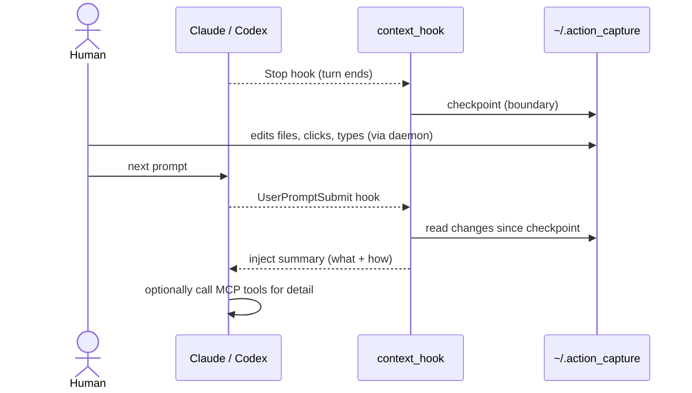
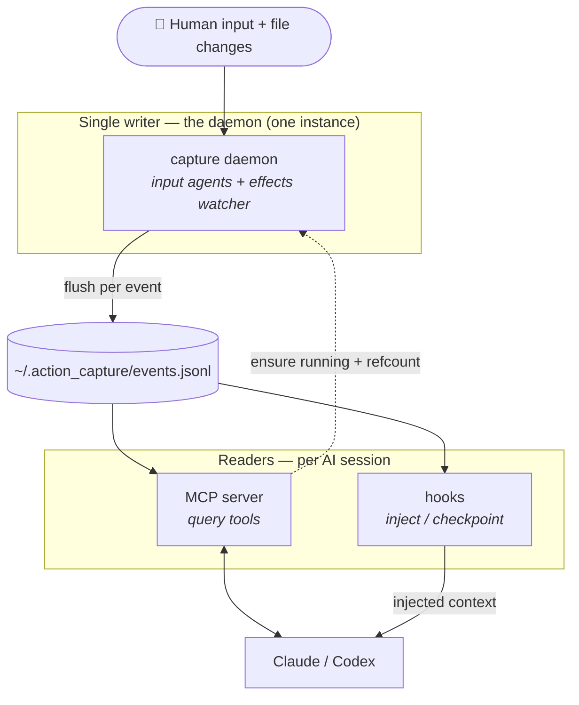
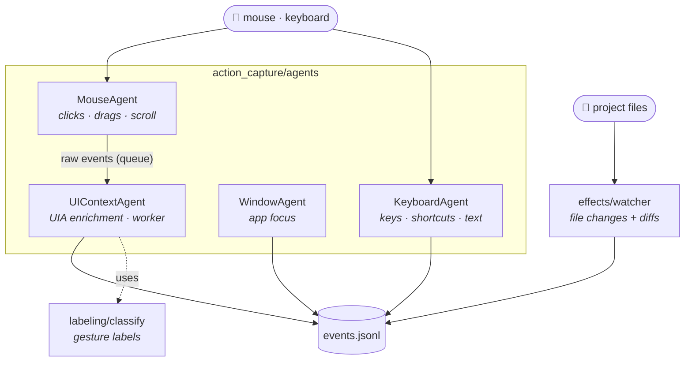

# mark43 — human-action context for AI assistants

Gives an AI assistant (Claude Code, Codex) context about **what the human did
and how**, between turns. When you ask the assistant to change something and
then edit files, draw, or click around yourself, the assistant sees what
changed — file diffs plus the input actions that produced them — on your next
prompt.

Under the hood it's a Windows **computer-use recorder** (mouse, keyboard, UI
context via UI Automation, and filesystem changes) that streams a JSONL
timeline, exposed to the assistant over the Model Context Protocol (MCP). The
same recorder doubles as a dataset generator for training.

## Quick start

```bash
python install.py        # or double-click install.bat on Windows
```

The installer runs `pip install -e .` and registers the `action-capture` MCP
server + activity hooks **globally** for Codex and Claude Code. Restart the
client and it just works: open any project, and the assistant gets your
between-turn activity automatically.

See [`docs/INTEGRATION.md`](docs/INTEGRATION.md) for flags, manual setup, and
the project-scoped alternative.

## How it works (the turn loop)



The `Stop` checkpoint marks "AI finished, human's turn starts", so the injected
window contains the human's work only — not the assistant's own edits.

## Architecture

One **single-instance daemon** writes the timeline; each AI session runs cheap
**readers** (the MCP server and the hooks). The MCP server also ensures the
daemon is running and keeps a PID-based refcount, so exactly one capture
process runs no matter how many sessions are open, and it stops when the last
one closes.



### Inside the daemon

Each concern is a standalone **agent** emitting enriched events into the single
timeline. Mouse events go through a UI-Automation enrichment worker so the
input listeners never block; the effects watcher adds filesystem changes.



### Modules

| Module | Responsibility |
|--------|----------------|
| `capture.py` / `install.py` | Recorder entry point / one-command installer. |
| `agents/mouse.py` | Clicks (single/double/triple), scroll, drags with a sampled path. |
| `agents/keyboard.py` | Keys, shortcuts, typed-text aggregation, password redaction. |
| `agents/ui_context.py` | Resolves the UIA element (type, name, state, ancestry), drop target, selected text, a11y snapshot. |
| `agents/window.py` | Application focus changes. |
| `agents/snapshot.py` | Bounded accessibility tree (structured "screenshot"). |
| `effects/watcher.py` | Polls session roots, emits `file_change` events. |
| `effects/differ.py` | Text detection + unified diffs. |
| `labeling/classify.py` | Gesture classification and readable labels (pure). |
| `core/events.py` | Event schema (`schema_version`, `seq`, `timestamp`) + JSONL sink. |
| `core/secure.py` | Password-field detection (UIA `IsPassword` + Win32 `ES_PASSWORD`). |
| `core/win32util.py` | Active window, monitor, geometry, cursor shape. |
| `core/paths.py` | Shared user-level log location. |
| `core/state.py` | Shared modifiers + pause flag. |
| `daemon/` | Single-instance guard, session refcount, launcher, idle monitor. |
| `mcp/` | MCP server + log store (query tools). |
| `integrations/context_hook.py` | Hook CLI: `inject` / `checkpoint`. |
| `recorder.py` | Wires the agents and runs the session. |

## MCP tools

| Tool | Returns |
|------|---------|
| `get_changes_since_last_turn()` | File changes (with diffs) + action summary since the last checkpoint. The headline tool. |
| `get_file_changes(since_seq, limit)` | Just the file changes/diffs. |
| `list_actions(...)` | Filtered actions (by process, event type, time range). |
| `summarize_session()` | High-level counts for the whole session. |
| `checkpoint(label)` | Mark a turn boundary. |

## Event types

`click` · `drag` · `scroll` · `key` · `hotkey` · `text_input` ·
`window_focus` · `file_change`, each with `schema_version`, `seq` (true
creation order), `timestamp`, window/process, and — where applicable — the
target UI element (type, name, state, ancestry) or a text diff.

## Manual capture (dataset mode)

To just record a session (e.g. to build a training dataset), run the recorder
directly:

```bash
python capture.py                    # full capture (aggregated text)
python capture.py --capture-text     # + selected text (never in password fields)
python capture.py --a11y-snapshot    # + accessibility tree per click
python capture.py --mask-keys        # no key content (categories only)
python capture.py --out session1     # output folder for this session
python capture.py --help
```

Controls: `Esc` stops · `Ctrl+Alt+P` pauses/resumes. Output goes to
`<out>/events.jsonl` (default `~/.action_capture`).

## Privacy

- Content typed into **password fields is omitted entirely** (UI Automation
  `IsPassword` + Win32 `ES_PASSWORD`).
- Selected text is only stored with `--capture-text`, never in secure fields.
- The log may contain personal data; it lives outside the repo
  (`~/.action_capture`) and `dataset/` / `*.jsonl` are gitignored.
- Capture is Windows-only (win32 + UIA).

## More

- [`docs/DESIGN.md`](docs/DESIGN.md) — full design, decisions, and phases.
- [`docs/INTEGRATION.md`](docs/INTEGRATION.md) — Claude Code & Codex setup.
