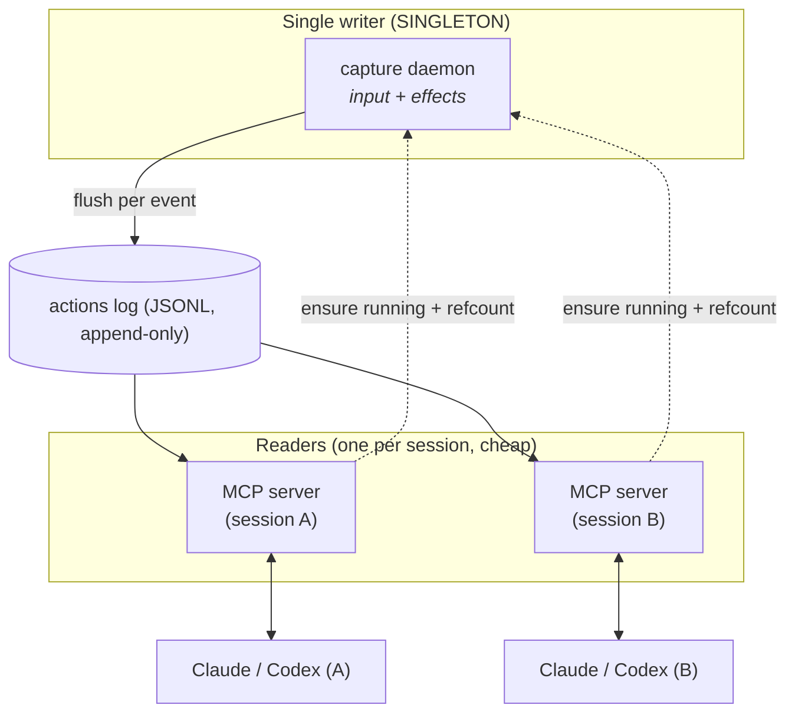

# Design: human-action context for AI assistants (MCP)

## Goal

Give an AI coding/task assistant (Claude Code, Codex) context about **what the
human did and how**, between AI turns. When the assistant asks the human to
change something and the human then acts, the assistant should be able to learn
what changed and the manner in which it was done.

## Two layers of signal

The existing capture records **input mechanics** (clicks, keys, gestures, UIA
targets). That answers **how**. On its own it's the wrong granularity for
**what changed** — for that we add an adaptive *effect* layer.

| Work type | Source of the "what changed" |
|-----------|------------------------------|
| Code / text (repo or not) | Textual diff / git diff. |
| Any file (binary, CAD, image) | File-change event: path, size, mtime. |
| Complex GUI apps (SolidWorks, Photoshop, Excel) | The **process layer already covers this**: UIA labels capture "clicked menu 'Extrude'", "edited cell 'A1'". |
| Canvas / drawing | `free_stroke` trajectories (+ optional OCR). |
| Apps with an API | Optional per-app adapter (feature tree, layers, cells). |

Key point: for non-text apps, the UIA process layer **is** the semantic effect
layer. The textual diff is an *additional* strategy for text files, not a
replacement. So the effect layer is **adaptive with a UIA fallback**, never a
mandatory `git diff`.

## Architecture: writer / reader split

- **The capture daemon is the only singleton** (guarded by a Windows named
  mutex: a second instance exits immediately). It is the sole writer.
- **MCP servers are cheap readers**, one per session. MCP is a standard both
  Claude Code and Codex support, so the server is written once for both.
- **The MCP server doubles as the launcher.** Since both clients spawn the MCP
  server on session start, the server ensures the daemon is running and manages
  a PID-based refcount. This removes the need for platform-specific start hooks
  and directly satisfies "only one capture process at a time".
- Backstops for a hard-killed MCP (leaked refcount): daemon **heartbeat +
  idle-timeout**.

## Decisions (agreed)

- Effect layer: **both**, adaptive (text diff where useful, UIA fallback else).
- Targets: **Claude Code and Codex in parallel** (agnostic core, thin
  per-client integration).
- Capture scope: **everything, no filter** (password redaction still enforced).
- Stop policy: **refcount** — daemon stops when the last session closes.

## MCP tools

- `get_changes_since_last_turn()` — the headline tool: file changes + text
  diffs + a **summarized** action timeline since the last checkpoint.
- `checkpoint(label)` — mark a turn boundary.
- `list_actions(since, until, process, limit, event_types)` — filtered query
  (covers "actions per program").
- `get_file_changes(since)` — the effect layer.
- `summarize_session()` — high-level counts and timeline.

Tools **summarize** rather than dump raw events, so the assistant's context
isn't flooded (critical given unfiltered capture generates many events).

## Open technical items

1. **Attribution (human vs AI):** even capturing everything, we must mark turn
   boundaries and filter out the assistant's own file edits and the human's
   chat typed to the AI.
2. **Volume / rotation:** unfiltered capture is high-volume; log rotation and
   MCP-side summarization are essential.
3. **Privacy:** data leaves to the model provider; password redaction stays on;
   documented tradeoff.
4. **Codex specifics:** confirm its exact MCP + context-injection support before
   the integration phase.
5. **Cross-platform:** capture is Windows-only today (win32 + UIA).

## Phases

- **F1 — MCP reader (MVP):** MCP server over the current JSONL with
  `checkpoint`, `list_actions`, `summarize_session`,
  `get_actions_since_last_checkpoint`. Manual start. ✅ *done*
- **F2 — Singleton daemon + refcount via MCP:** ✅ *done*. Windows named mutex
  (`daemon/coordination.py`) makes the capture daemon single-instance; the MCP
  server registers a PID-based session and spawns the daemon detached
  (`daemon/launcher.py`); an idle monitor (`daemon/monitor.py`) stops the
  daemon once no live session remains. *(Log rotation deferred to F3.)*
- **F3 — Adaptive effect layer:** filesystem watcher (universal) + text differ
  + human/AI attribution.
- **F4 — Integrations:** Claude Code `UserPromptSubmit` hook + skill; Codex MCP
  config; automatic context injection.
- **F5 — Future:** per-app adapters (SolidWorks API, etc.) + OCR for canvas.
